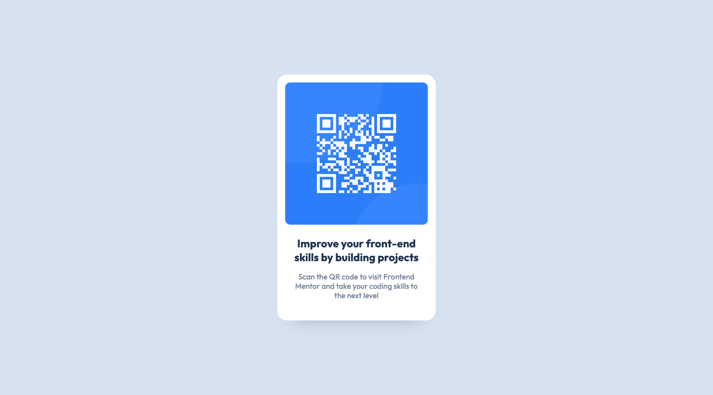

# Frontend Mentor - QR Code Component Solution

This is a solution to the [QR Code Component Challenge on Frontend Mentor](https://www.frontendmentor.io/challenges/qr-code-component-iux_sIO_H). Frontend Mentor challenges help you improve your coding skills by building realistic projects. 

### Screenshot

### What I learned

I learned how to apply a CSS-only tilt effect on the card when hovering over it. The movement is a little jerky, but I was not able to find a JavaScript tutorial explaining how to create a smoother tilt effect. Many tutorials made use of a library, but I felt I would not learn anything if I did this.